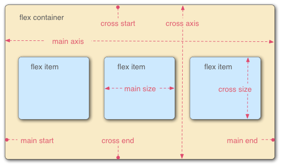

import HtmlDemo from '../../../src/components/HtmlDemo.js';

弹性盒子是一种用于按行或按列布局的一维布局方法，元素可以膨胀以填充额外的空间，收缩以适应更小的空间

## 主轴与交叉轴

默认横的主轴，竖的交叉轴



## flex 容器

flex 容器：`flex-direction | flex-warp | flex-flow | justify-content | align-items | align-content`

### flex-direction（改变轴方向）

- row 默认，横为主轴
- row-reverse 横主轴反向
- column 设置列为主轴
- column-reverse 列主轴反向

<HtmlDemo>

``` html
<style>
    .main {
        width: 500px;
        height: 500px;
        background-color: skyblue;
        display: flex;  
        flex-direction: column; /* 改变轴方向 */                 
    }

    .main div {
        width: 100px;
        height: 100px;
        background-color: pink;
        font-size: 20x;
    }
</style>

<div class="main">
    <div>1</div>
    <div>2</div>
    <div>3</div>
</div>
```

</HtmlDemo>

### flex-warp（换行）与 flex-flow（缩写）

flex-warp

- nowrap 默认，无换行
- warp 换行
- wrap-reverse 反向换行

flex-flow：[flex-direction][flex-warp]

<HtmlDemo>

``` html
<style>
    .main {
        width: 500px;
        height: 500px;
        background-color: skyblue;
        display: flex;
        /* flex-direction: column; 改变轴方向   */
        /* flex-wrap: wrap;换行与缩进 */
        /* 缩写 */
        flex-flow: column wrap; 
    }

    .main div {
        width: 100px;
        height: 100px;
        background-color: pink;
        font-size: 20x;
    }
</style>

<div class="main">
    <div>1</div>
    <div>2</div>
    <div>3</div>
    <div>4</div>
    <div>5</div>
    <div>6</div>
    <div>7</div>
    <div>8</div>
</div>
```

</HtmlDemo>

### just-content（主轴对齐）

- flex-start 默认，开头对齐
- flex-end 结尾对齐
- center  中间对齐
- space-around 闲散对齐，开头空隙和结尾空隙 = 中间空隙 / 2
- space-between 两端对齐，开头和结尾无空隙，中间空隙相等
- space-evenly 平均对齐，开头空隙，结尾空隙和中间空隙都相等
  
<HtmlDemo>

``` html
<style>
    .main {
        width: 500px;
        height: 500px;
        background-color: skyblue;
        display: flex;
        justify-content: space-around; /*主轴对齐*/
    }

    .main div {
        width: 100px;
        height: 100px;
        background-color: pink;
        font-size: 20x;
    }
</style>

<div class="main">
    <div>1</div>
    <div>2</div>
    <div>3</div>
</div>
```

</HtmlDemo>

### align-content（交叉轴对齐）

> 当不换行的情况下， `align-content` 不生效，所以必须配合 `flex-wrap: wrap;` 使用

- stretch 默认，拉伸：**当子元素不设置高度时拉伸为父容器的高度**
- flex-start 开头对齐
- flex-end 结尾对齐
- center  中间对齐
- space-around 闲散对齐，开头空隙和结尾空隙 = 中间空隙 / 2
- space-between 两端对齐，开头和结尾无空隙，中间空隙相等
- space-evenly 平均对齐，开头空隙，结尾空隙和中间空隙都相等

<HtmlDemo>

``` html
<style>
    .main {
        width: 500px;
        height: 500px;
        background-color: skyblue;
        display: flex; 
        flex-wrap: wrap;
        /* 当不换行的情况下， align-content 不生效 */
        align-content: stretch;          
    }

    .main div {
        width: 100px;
        /* height: 100px; */
        background-color: pink;
        font-size: 20x;
    }
</style>

<div class="main">
    <div>1</div>
    <div>2</div>
    <div>3</div>
    <div>4</div>
    <div>5</div>
    <div>6</div>
    <div>7</div>
</div>
```

</HtmlDemo>

### align-items（行对齐）

- stretch 默认，拉伸
- flex-start 顶部对齐
- flex-end 底部对齐
- center 中间对齐
- baseline 底线对齐

<HtmlDemo>

``` html
<style>
    .main {
        width: 500px;
        background-color: skyblue;
        display: flex;            
        align-items: flex-end;      
    }

    .main div {
        width: 100px;
        height: 100px;
        background-color: pink;
        font-size: 20x;
    }
</style>

<div class="main">
    xyz
    <div>1</div>        
</div>
```

</HtmlDemo>

下面是一些布局案例

### 内联与块级元素居中布局

内联元素居中

- 单行居中：line-height 等于父容器 height
- 多行居中：display: flex;
- 多行居中：display: table-cell;


<HtmlDemo>

``` html
<style>
    .box {
        margin-bottom: 10px;
        width: 300px;
        height: 100px;
        background-color: skyblue;
    }

    .box1 {
        line-height: 100px;
    }

    .box2 {
        display: flex;
        align-items: center;
    }

    .box3 {
        display: flex;
        flex-wrap: wrap;
        align-content: center;
    }

    .box4 {
        display: table-cell;
        vertical-align: middle;
    }
</style>

<div class="box box1">
    单行文字
    <code>line-height:10px</code>
</div>
<div class="box box2">

    <pre>
多行文字 
        display: flex;
        align-items: center;
    </pre>
</div>
<div class="box box3">
    <pre>
多行文字 
        display: flex;
        flex-wrap: wrap;
        align-content: center;
    </pre>
</div>
<div class="box box4">
    <pre>
多行文字            
        display: table-cell;
        vertical-align: middle;
    </pre>
</div>
```

</HtmlDemo>

块级元素居中

- 使用 flex 居中
- 使用 position 绝对定位居中

<HtmlDemo>

``` html
<style>
    .box {
        margin-bottom: 10px;
        width: 300px;
        height: 200px;
        background-color: skyblue;
        position: relative;
    }

    .box div {
        width: 200px;
        height: 100px;
        background-color: pink;
    }

    .box1 {
        display: flex;
        /* 左右居中 */
        justify-content: center;
        /* 垂直居中 */
        align-items: center;
    }

    .box2 div {
        position: absolute;
        top: 50%;
        left: 50%;
        transform: translate(-50%, -50%);
    }

    .box3 {
        display: flex;
    }

    .box3 div {
        margin: auto;
    }

    .box4 div {
        position: absolute;
        top: 0;
        left: 0;
        right: 0;
        bottom: 0;
        margin: auto;
    }
</style>

<div class="box box1">
    <div>
        <pre>
display: flex;
justify-content: center;
align-items: center;
        </pre>
    </div>
</div>
<div class="box box2">
    <div>
        position: relative;
        <pre>
position: absolute;
top: 50%;
left: 50%;
transform: translate(-50%, -50%);
        </pre>
    </div>
</div>
<div class="box box3">

    <div>
        display: flex;
        <pre>
margin: auto;
        </pre>
    </div>
</div>
<div class="box box4">
    <div>
        position: relative;
        <pre>
position: absolute;
top: 0;
left: 0;
top: 0;
bottom: 0;
margin: auto;
        </pre>
    </div>
</div>
```

</HtmlDemo>

### 不定项居中布局

- 使用 flex 居中
- 使用 position 绝对定位居中

<HtmlDemo>

``` html
<style>
    .box {
        width: 300px;
        height: 150px;
        background-color: skyblue;
        margin-bottom: 10px;
    }

    .box div {
        width: 30px;
        height: 30px;
        background-color: pink;
        border-radius: 50%;
        text-align: center;
        line-height: 30px;
    }

    .box1 {
        display: flex;
        justify-content: center;
        align-items: flex-end;
    }

    .box1 div {
        margin: 10px;
    }

    .box2 {
        position: relative;
    }

    .box2 section {
        width: 100%;
        position: absolute;
        text-align: center;
        bottom: 0;
        font-size: 0;
    }

    .box2 div {
        display: inline-block;
        margin: 10px;
        font-size: 16px;
    }
</style>

<div class="box box1">
    <div>1</div>
    <div>2</div>
    <div>3</div>
</div>
<div class="box box2">
    <section>
        <div>1</div>
        <div>2</div>
        <div>3</div>
    </section>
</div>
```

</HtmlDemo>

### 均分列布局

- 使用 flex 均分列
- 使用 float + position 布局（例子中没自适应）

<HtmlDemo>

``` html
<style>
  .box {
      height: 150px;
      background-color: skyblue;
      margin-bottom: 10px;

  }

  .box div {
      width: 30px;
      height: 30px;
      background-color: pink;
      border-radius: 50%;
      text-align: center;
      line-height: 30px;
  }

  .box1 {
      display: flex;
      justify-content: space-between;
      align-items: flex-end;
      padding: 0 20px;
  }

  .box2 {
      width: 500px;
      padding: 0 20px;
      overflow: hidden;
      box-sizing: border-box;
      position: relative;
  }

  .box2 section {
      width: 600px;
      position: absolute;
      bottom: 0;
  }

  .box2 div {
      float: left;
      margin-right: 77px;
  }
</style>

<div class="box box1">
  <div>1</div>
  <div>2</div>
  <div>3</div>
  <div>4</div>
  <div>5</div>
</div>
<div class="box box2">
  <section>
      <div>1</div>
      <div>2</div>
      <div>3</div>
      <div>4</div>
      <div>5</div>
  </section>
</div>
```

</HtmlDemo>


### 子项分组布局

- 使用 flex + 分组
- 使用 flex + margin-right:auto 自适应

<HtmlDemo>

``` html
<style>
  .box {
      height: 200px;
      background-color: skyblue;
      margin-bottom: 10px;

  }

  .box .item {
      width: 50px;
      height: 100px;
      background-color: pink;
      text-align: center;
      line-height: 100px;
  }

  .box1 {
      display: flex;
      justify-content: space-between;
      align-items: center;
  }

  .box1 div:nth-of-type(2) {
      display: flex;
      margin-left: 10px;
  }

  .box2 {
      display: flex;
      align-items: center;
  }

  .box2 div {
      margin-right: 10px;
  }

  .box2 div:nth-of-type(3) {
      margin-right: auto;
  }

  .box2 div:nth-of-type(4) {
      margin-right: auto;
  }
</style>

<div class="box box1">
  <div class="item">1</div>
  <div>
      <div class="item">2</div>
      <div class="item">3</div>
  </div>
</div>
<div class="box box2">
  <div class="item">1</div>
  <div class="item">2</div>
  <div class="item">3</div>
  <div class="item">4</div>
  <div class="item">5</div>
  <div class="item">6</div>
</div>
```

</HtmlDemo>


## flex 子项

flex 子项：`order | flex-grow | flex-shrink | flex-basis | flex | align-self`

