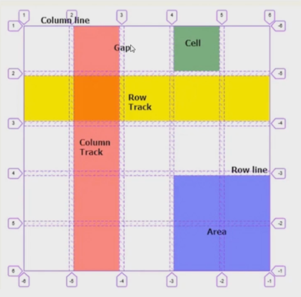

import HtmlDemo from '@site/src/components/HtmlDemo.js';

CSS 网格是一个用于 web 的二维布局系统。利用网格，你可以把内容按照行与列的格式进行排版。另外，网格还能非常轻松地实现一些复杂的布局

## grid 容器

grid 容器有很多项

### 定义网格及 fr 单位



- `grid-template-rows` 和 `grid-template-columns` 用来基于网格行和列的维度，去定义网格线的名称和网格轨道的尺寸大小
- 单位 fr 是按剩余空间的比例计算，比如总的宽度 300px，设置 `grid-template-columns: 150px 1fr 1fr` 宽度分别：150px 75px 75px

<HtmlDemo>

```html
<style>
    .main {
        width: 300px;
        height: 300px;
        background: skyblue;
        display: grid;
        /* 定义三列 和 三列*/
        /* grid-template-columns: 100px 100px 100px;           
        grid-template-rows: 100px 100px 100px; */

        /* 可以是其他单位 */
        grid-template-columns: 100px 20% auto;
        grid-template-rows: 50px 100px;

        /* 专属单位 fr 比例*/
        grid-template-columns: 150px 1fr 1fr;
        grid-template-rows: 0.3fr 0.4fr;
    }

    .main div {
        background-color: pink;
    }
</style>
<div class="main">
    <div>1</div>
    <div>2</div>
    <div>3</div>
    <div>4</div>
    <div>5</div>
    <div>6</div>
</div>
```

</HtmlDemo>


### 合并网格及网名命名

- `grid-template-areas` 使用命名方式定义网格区域，需配合 `grid-area` 属性进行使用


<HtmlDemo>

```html
<style>
    .box {
        margin-bottom: 10px;
        width: 300px;
        height: 300px;
        background: skyblue;
        display: grid;
    }

    .box div {
        background-color: pink;
        border: 1px gray solid;
        box-sizing: border-box;
    }

    .box1 {
        /* 定义网格 */
        grid-template-columns: 1fr 1fr 1fr;
        grid-template-rows: 1fr 1fr 1fr;
        /* 合并网格及网名命名 */
        grid-template-areas:
            "a1 a1 a2"
            "a1 a1 a2"
            "a3 a3 a3";
    }

    .box1 div:nth-of-type(1) {
        /* 第1个元素占4个空间 */
        grid-area: a1;
    }

    .box1 div:nth-of-type(2) {
        /* 第2个元素占2个空间 */
        grid-area: a2;
    }

    .box1 div:nth-of-type(3) {
        /* 第3个元素占3个空间 */
        grid-area: a3;
    }

    .box2 {
        /* 定义网格 */
        grid-template-columns: 1fr 1fr 1fr;
        grid-template-rows: 1fr 1fr 1fr;
        grid-template-areas:
            "a1 a2 a3";
    }

    .box2 div:nth-of-type(1) {
        /* 第1个元素放到第三个位置了*/
        grid-area: a3;
    }
</style>
<div class="box box1">
    <div>1 <small>第1个元素占4个空间</small></div>
    <div>2 <small>第2个元素占2个空间</small></div>
    <div>3 <small>第3个元素占3个空间</small></div>
</div>

<div class="box box2">
    <div>1 <small>第1个元素放到第三个位置了</small></div>
    <div>2</div>
    <div>3</div>
</div>
```

</HtmlDemo>

- `grid-template` 是  `grid-template-rows`，`grid-template-columns` 和 `grid-template-areas` 的 缩写

<HtmlDemo>

```html
<style>
    .box {
        margin-bottom: 10px;
        width: 300px;
        height: 300px;
        background: skyblue;
        display: grid;
    }

    .box div {
        background-color: pink;
        border: 1px gray solid;
        box-sizing: border-box;
    }

    .box1 {
        /* 定义网格 */
        /* grid-template-columns: 1fr 1fr 1fr;
        grid-template-rows: 1fr 1fr 1fr; */
        /* 合并网格及网名命名 */
        /* grid-template-areas:
            "a1 a1 a2"
            "a1 a1 a2"
            "a3 a3 a3"; */

        grid-template:
            "a1 a1 a2" 1fr
            "a1 a1 a2" 1fr
            "a3 a3 a3" 1fr
            / 1fr 1fr 1fr;
    }

    .box1 div:nth-of-type(1) {
        /* 第1个元素占4个空间 */
        grid-area: a1;
    }

    .box1 div:nth-of-type(2) {
        /* 第2个元素占2个空间 */
        grid-area: a2;
    }

    .box1 div:nth-of-type(3) {
        /* 第3个元素占3个空间 */
        grid-area: a3;
    }
</style>

<div class="box box1">
    <div>1 
        <pre>
缩写                
grid-template:
"a1 a1 a2" 1fr
"a1 a1 a2" 1fr
"a3 a3 a3" 1fr
/ 1fr 1fr 1fr;                
        </pre>
    </div>
    <div>2</div>
    <div>3</div>
</div>
```

</HtmlDemo>

### 网格间隙及简写

- `grid-row-gap`， `grid-column-gap` 和 `grid-gap` 用来设置元素行列之间的间隙大小，推荐使用 `row-gap`,`column-gap`,`gap`，`grid-` 前缀已废弃
- `gap` 是 `row-gap` 和 `column-gap` 的缩写，比如 flex 布局也支持 `gap` 属性

<HtmlDemo>

```html
<style>
    .box {
        margin-bottom: 10px;
        width: 300px;
        height: 300px;
        background: skyblue;
    }

    .box div {
        background-color: pink;
        border: 1px gray solid;
        box-sizing: border-box;
    }

    .box1 {
        display: grid;
        grid-template:
            "a1 a1 a2"1fr "a1 a1 a2"1fr "a3 a3 a3"1fr / 1fr 1fr 1fr;

        /* 行间隙 */
        /* grid-row-gap: 20px; */
        /* 列间隙  */
        /* grid-column-gap: 30px; */

        /* 两者的缩写 */
        gap: 20px 30px;
    }

    .box1 div:nth-of-type(1) {
        grid-area: a1;
    }

    .box1 div:nth-of-type(2) {
        grid-area: a2;
    }

    .box1 div:nth-of-type(3) {
        grid-area: a3;
    }

    .box2 {
        display: flex;
        flex-wrap: wrap;
        align-content: flex-start;
        /* 也支持间隙 */
        row-gap: 20px;
        column-gap: 30px;
    }

    .box2 div {
        width: 130px;
        height: 100px;
    }
</style>

<div class="box box1">
    <div>1 
        <pre>
display: grid; 
gap: 20px 30px;
        </pre> 
    </div>
    <div>2</div>
    <div>3</div>
</div>

<div class="box box2">
    <div>1
        <pre>
display: flex 也支持间隙
row-gap: 20px;
column-gap: 30px;
        </pre>
    </div>
    <div>2</div>
    <div>3</div>
    <div>4</div>
    <div>5</div>
</div>
```

</HtmlDemo>


### 多种组合排列布局

<HtmlDemo>

```html
<style>
    .main {
        width: 300px;
        height: 300px;
        background: skyblue;
        display: grid;
        grid-template-columns: repeat(3, 1fr);
        grid-template-rows: repeat(3, 1fr);
        gap: 5px
    }

    .main div {
        background-color: pink;
    }

    .main div:nth-of-type(1) {
        grid-area: 1/1/span 2/ span 2;
    }
</style>
<div class="main">
    <div>1</div>
    <div>2</div>
    <div>3</div>
    <div>4</div>
    <div>5</div>
    <div>6</div>
</div>
```

</HtmlDemo>

### 栅格布局

